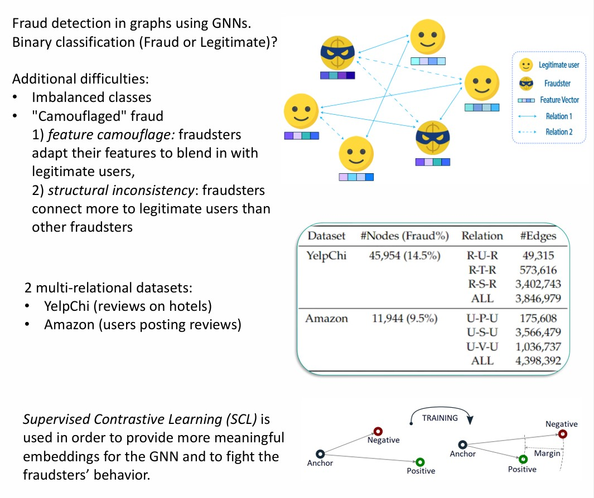
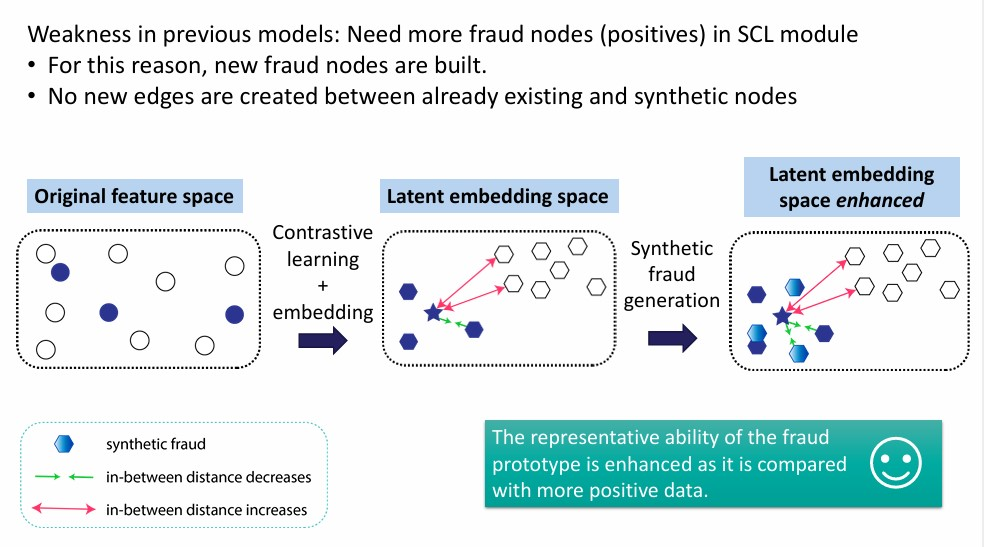

This is the code implementation of the paper "Enhancing Fraud Detection in GNNs with
Synthetic Fraud Generation and Integrated Structural Features" (ICANN 2024).

## Dataset

YelpChi and Amazon can be downloaded from [here](https://github.com/YingtongDou/CARE-GNN/tree/master/data).

Run inside the data directory `wget https://github.com/YingtongDou/CARE-GNN/raw/master/data/YelpChi.zip && unzip YelpChi.zip` 

Run `python src/data_process.py` to pre-process the data.


## Usage

```sh
python main.py --config ./config/brie_yelpchi.yml
```

## Brief Description

### Introduction


### Contribution - BRIE


#### Additional structural features (Contribution 1)


#### Synthesizing fraud nodes (Contribution 2)


#### Results


#### Conclusion
